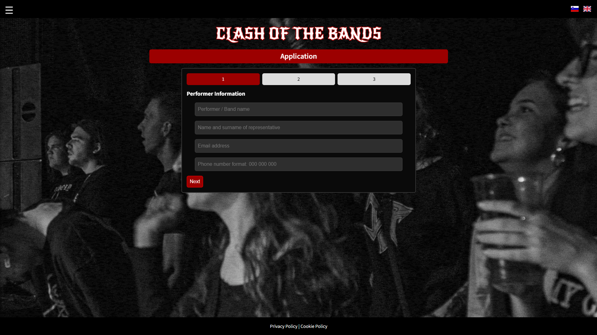
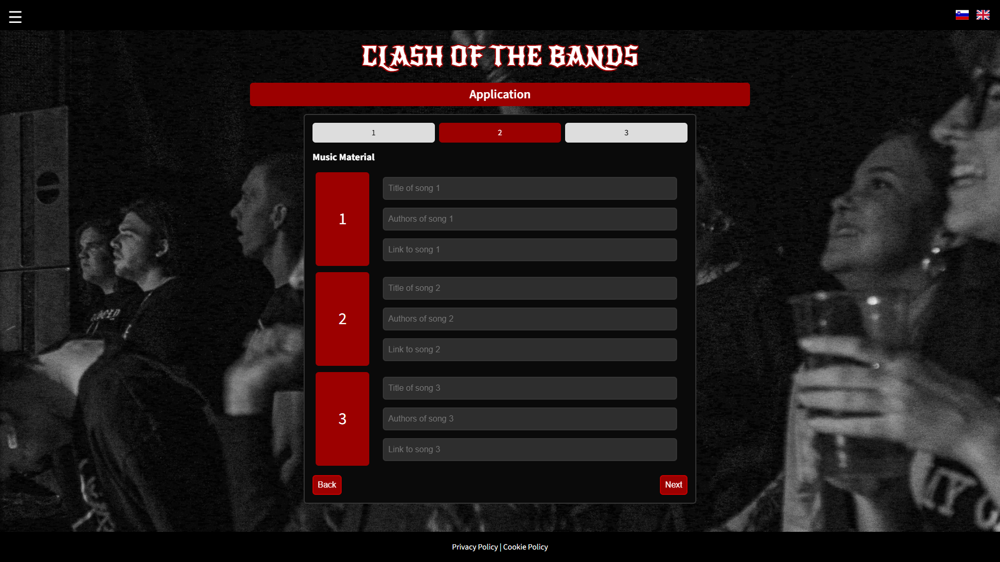
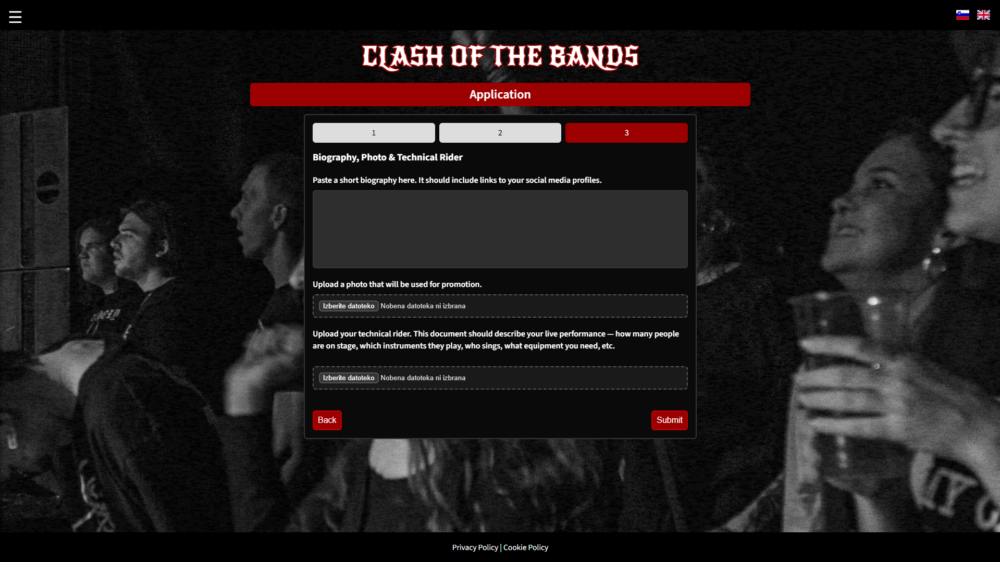
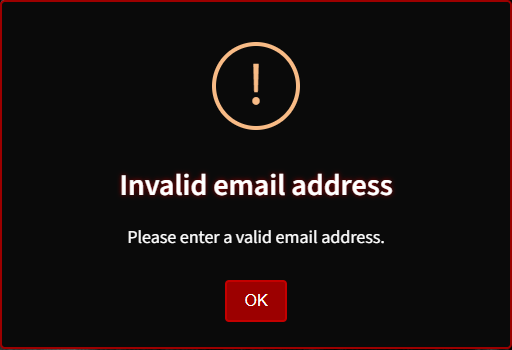
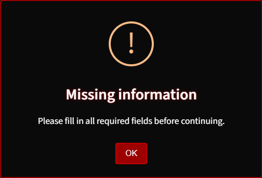
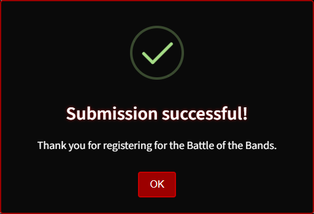

# **Clash of the Bands -- Form** 

An interactive multi-stage registration system for *Clash of the Bands*, with a sharp
visual style, real-time validation and bilingual support.

## Features

- **3-step signup form**

- **Real-time validation** (email, phone, URL)
- **SweetAlert2 alerts and confirmations**
- **Slovenian & English**
- **Progress indicator** (1--2--3)

## Pictures
### Form steps

### SweetAlert2 Messages

## Technologies used

- HTML5
- CSS3
- Vanilla JavaScript
- SweetAlert2
- Google Fonts (Novi Rocker, Source Sans 3)

## License

MIT

## Author

Abel Elersič

